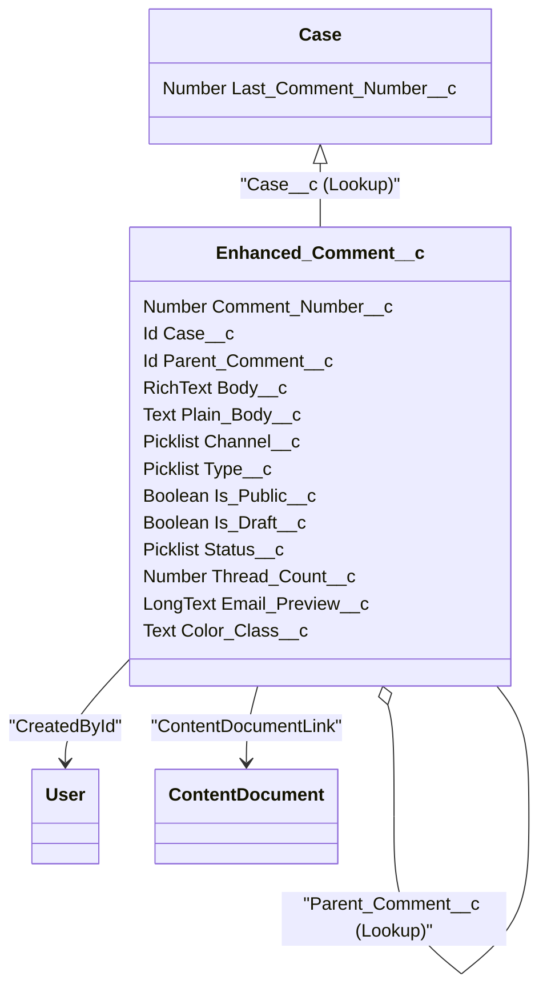

# Enhanced Comment — Data Model

This document defines the detailed data model for the Enhanced Comment solution described in `ENHANCED_COMMENT_DESIGN.md`.

## Goals
- Persist rich comments up to ~1.31K bytes (rich text).
- Support replies (threading), attachments, drafts, and multiple channels.
- Provide efficient search, pagination, and per-case sequential numbering.
- Ensure security (FLS/CRUD), sharing, and maintainability.

## Objects & Relationships (ER)

Mermaid ER (class) diagram (renderable where supported):




## Object: Enhanced_Comment__c

API name: `Enhanced_Comment__c`
Label: Enhanced Comment

Recommended fields (exact API names suggested):

- Comment_Number__c — Number(18,0) — sequential per Case, index this field if searches by number are common.
- Case__c — Lookup(Case) — required, indexed (lookup index exists by default).
- Parent_Comment__c — Lookup(Enhanced_Comment__c) — optional, used for replies.
- Body__c — Rich Text Area(1310) — stores HTML formatted content.
- Plain_Body__c — Text Area(1310) — stripped plaintext copy used for SOSL/SOQL LIKE.
- Channel__c — Picklist — values: Case Comment, Email, Case History, Chat, Other.
- Type__c — Picklist — values: Note, Reply, Email, System.
- Is_Public__c — Checkbox — default true.
- Is_Draft__c — Checkbox — default false.
- Status__c — Picklist — values: Active, Deleted, Archived — default Active.
- Thread_Count__c — Number(18,0) — denormalized count of replies (speed up UI).
- Email_Preview__c — Long Text Area(32768) — optional formatted email content.
- Color_Class__c — Text(40) — optional per-comment CSS class or color name.
- CreatedById / CreatedDate / LastModifiedDate — standard audit fields.

Indexes & selective queries:
- `Case__c` is indexed by default (lookup). Use it as the primary filter.
- Consider adding a custom index on `Is_Draft__c` if drafts are many and frequently filtered.
- If searching by channel often, consider an index on `Channel__c` (indexing picklists requires special handling: use formula/text field if necessary).

Storage considerations:
- Rich text stores HTML; store a plaintext copy in `Plain_Body__c` to simplify text searches.
- Email preview can be large — store only when channel == Email.


## Supporting fields on Case

- Last_Comment_Number__c (Number(18,0)) — per-Case counter used to assign `Comment_Number__c`. This field is updated in a transaction with `SELECT ... FOR UPDATE` to avoid race conditions.

Design note: using a per-case counter avoids global contention and presents stable numbers for UI.


## Attachments & Files

- Use ContentVersion/ContentDocument with `ContentDocumentLink` records to link files to `Enhanced_Comment__c`.

Pattern options:
1. Upload files to the Case (using `lightning-file-upload` with recordId=caseId), then re-link the ContentDocument to the created Enhanced_Comment__c (create a new ContentDocumentLink with LinkedEntityId = enhancedCommentId). This avoids staging records and is simple for the UI.
2. Upload directly to Enhanced_Comment__c after the record is created (requires the record to exist first).

Security: ensure user has Create permission on ContentVersion and correct sharing to view files.


## Custom Metadata & Config

- EnhancedComment_Channel_Color__mdt
  - Channel__c (Text)
  - ColorHex__c (Text) — e.g. #1f77b4
  - TextColor__c (Text) — text color for contrast

- EnhancedComment_Config__mdt
  - Default_Page_Size__c (Number)
  - Default_Channels__c (Text)
  - QuickAdd_Default_IsPublic__c (Checkbox)


## Business Logic / Automation

1) Assigning Comment_Number__c (atomic increment)

Apex pseudo-code (create comment):

```apex
public static Id createComment(EnhancedCommentInput input) {
  // 1. Lock the Case row for update to increment counter atomically
  Case c = [SELECT Id, Last_Comment_Number__c FROM Case WHERE Id = :input.caseId LIMIT 1 FOR UPDATE];
  Integer nextNumber = (c.Last_Comment_Number__c == null) ? 1 : Integer.valueOf(c.Last_Comment_Number__c) + 1;
  c.Last_Comment_Number__c = nextNumber;
  update c;

  // 2. Create comment
  Enhanced_Comment__c ec = new Enhanced_Comment__c(
    Case__c = input.caseId,
    Parent_Comment__c = input.parentCommentId,
    Body__c = input.bodyHtml,
    Plain_Body__c = input.bodyPlain,
    Comment_Number__c = nextNumber,
    Is_Public__c = input.isPublic,
    Is_Draft__c = input.isDraft,
    Channel__c = input.channel,
    Type__c = input.type
  );
  insert ec;

  // 3. Link attachments (if any) - create ContentDocumentLink records to ec.Id
  // 4. Optionally update thread_count on parent comment
  return ec.Id;
}
```

Notes:
- Use `with sharing` Apex controller to respect record sharing.
- Wrap in try/catch and return meaningful errors.

2) Maintaining Thread_Count__c

Options:
- Trigger on Enhanced_Comment__c AFTER INSERT/DELETE to increment/decrement `Thread_Count__c` on Parent_Comment__c.
- Use a scheduled batch to recalc counts for drift or recovery.

3) Soft delete & purge

- `deleteComment` should soft-delete by setting `Status__c = 'Deleted'` and optionally removing ContentDocumentLink depending on retention policy.
- Admins can run a scheduled job to hard-delete or archive old comments.


## Queries & Pagination

Example: list comments for a case, newest first, page-based pagination (SOQL OFFSET):

```sql
SELECT Id, Comment_Number__c, Body__c, Plain_Body__c, Channel__c, Is_Public__c, CreatedById, CreatedDate
FROM Enhanced_Comment__c
WHERE Case__c = :caseId AND Status__c = 'Active' AND (Is_Draft__c = false OR :includeDrafts)
ORDER BY Comment_Number__c DESC
LIMIT :pageSize OFFSET :offset
```

For large datasets prefer keyset pagination (by Comment_Number__c or CreatedDate + Id) instead of OFFSET.

Search example using SOSL (full-text across Body and Plain_Body):

```apex
List<List<sObject>> results = [FIND :searchText IN ALL FIELDS RETURNING Enhanced_Comment__c(Id, Comment_Number__c, Body__c WHERE Case__c = :caseId AND Status__c = 'Active')];
```


## Security & FLS

- Enforce `with sharing` on Apex controllers to respect sharing.
- Validate CRUD/FLS before reading/updating fields using `Schema.sObjectType(...).getDescribe()`.
- Only allow Edit/Delete for comment author or users with specific permission set (`Enhanced_Comment_Admin`) or `ModifyAll` perms.
- Ensure file links obey file visibility rules.


## Validation Rules (examples)

- Prevent saving non-draft comments with empty Body:
  - Rule Name: EnhancedComment_NonDraftBodyRequired
  - Formula: `NOT(Is_Draft__c) && ISBLANK(Plain_Body__c)`

- Limit Body length (server-side enforced in Apex as well):
  - Formula: `LEN(Plain_Body__c) > 1310` (optional if field length already enforces it)


## Trigger & Apex considerations

- Keep triggers minimal: delegate to a handler class.
- Write unit tests that simulate concurrent creation (use Test.startTest/Test.stopTest and multiple inserts) to validate counter increments.
- Handle bulk operations: batch-friendly trigger code.


## Unit Tests to cover

- createComment happy path (with attachments linked)
- createReply and verify parent Thread_Count__c increment
- concurrent creation test for Comment_Number__c uniqueness and increment
- updateComment permission checks
- deleteComment soft-delete behavior
- searchResults and listComments pagination


## Migration & Backfill

If migrating from Standard CaseComment records:
- Export CaseComment records and import into `Enhanced_Comment__c` (map CaseId -> Case__c, ParentId if available, CreatedBy, CreatedDate). Maintain original timestamps if required (use `FIELD HISTORY` or API with `setAuditFields=true` during deployment).
- Backfill `Case.Last_Comment_Number__c` by computing MAX(Comment_Number__c) per Case and updating Case.


## Example Apex snippets

Link ContentDocument to Enhanced Comment (after upload to Case):

```apex
// given contentDocumentId and enhancedCommentId
ContentDocumentLink link = new ContentDocumentLink(
  ContentDocumentId = contentDocumentId,
  LinkedEntityId = enhancedCommentId,
  ShareType = 'V' // Viewer
);
insert link;
```

Keyset pagination (newest first) example:

```apex
List<Enhanced_Comment__c> list = [
  SELECT Id, Comment_Number__c, Body__c, CreatedDate FROM Enhanced_Comment__c
  WHERE Case__c = :caseId AND Status__c = 'Active' AND Comment_Number__c < :cursorNumber
  ORDER BY Comment_Number__c DESC
  LIMIT :pageSize
];
```


## Notes & Trade-offs

- Using a per-Case counter requires `SELECT ... FOR UPDATE` which locks the Case row for the duration of the transaction; acceptable for typical volumes but may be a contention point in extremely high-concurrency scenarios.
- Storing plaintext copy increases storage but greatly simplifies searches.
- Soft-delete retains history and enables audit, while purge policies should be part of data retention planning.


---
Document created: 2026-04-30
