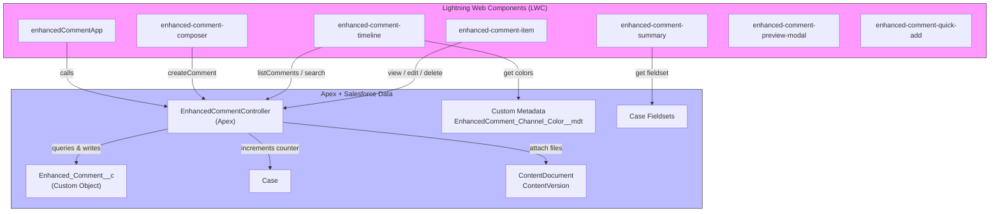

# Enhanced Comment Solution Design

> Design document for Enhanced Comment (custom long comment) solution for Cases.

## Overview

Goal: Replace the standard Case Comment limitations with a rich, extensible "Enhanced Comment" system that supports long comments (~1.31K bytes), rich text, attachments, threaded replies, drafts, multiple channels (Case Comment, Email, Case History, Chat), search, pagination, and admin-configurable Case Summary and Case Fields ordering using fieldsets.

Key features:
- Custom object `Enhanced_Comment__c` supporting rich text up to 1.31K bytes.
- Replies/threads (Parent_Comment__c) with expandable view.
- Composer with Rich Text Editor and attachments (`lightning-input-rich-text`, `lightning-file-upload`).
- Fieldset-driven Case Summary and Case Fields update UI.
- Comment Timeline with filters, search, colors, pagination, numbering, and actions (edit, delete, view, preview email).


## Architecture Diagram

Below is a high-level architecture diagram. It includes Apex services, LWC components, Salesforce objects, and Custom Metadata.

Mermaid sequence/architecture diagram (renderable in Markdown viewers that support Mermaid):



ASCII fallback diagram:

UI (LWCs)
  -> Apex Controller (EnhancedCommentController)
    -> Enhanced_Comment__c (stores comments)
    -> Case (stores per-case counter Last_Comment_Number__c)
    -> ContentDocument/ContentVersion (attachments)
    -> Custom Metadata (channel colors)
    -> Case fieldsets (Case_Summary_Fields, Case_Fields_Update)


## Data Model

Object: Enhanced_Comment__c
- API name: `Enhanced_Comment__c`
- Label: Enhanced Comment

Recommended fields:
- `Comment_Number__c` (Number(18,0)) — sequential per Case
- `Case__c` (Lookup(Case)) — required
- `Parent_Comment__c` (Lookup(Enhanced_Comment__c)) — optional
- `Body__c` (Rich Text Area, length 1310) — rich text content
- `Plain_Body__c` (Text Area (1310)) — plaintext copy for search
- `Channel__c` (Picklist) — e.g., Case Comment, Email, Case History, Chat
- `Type__c` (Picklist) — Note, Reply, Email, System
- `Is_Public__c` (Checkbox)
- `Is_Draft__c` (Checkbox)
- `Status__c` (Picklist) — Active, Deleted, Archived
- `Thread_Count__c` (Number) — denormalized count of replies
- `Email_Preview__c` (Long Text Area) — formatted email preview (optional)
- `Color_Class__c` (Text(40)) — optional per-comment color override
- Standard audit fields: `CreatedById`, `CreatedDate`, `LastModifiedDate`.

Additional: `Case.Last_Comment_Number__c` (Number(18,0)) — used to atomically assign `Comment_Number__c` on create.

Attachments: Use ContentDocument / ContentVersion and create ContentDocumentLink records with `LinkedEntityId = Enhanced_Comment__c`.

Custom Metadata:
- `EnhancedComment_Channel_Color__mdt` with fields `Channel__c`, `ColorHex__c`, `TextColor__c`.
- `EnhancedComment_Config__mdt` for defaults (page size, default channels, composer options).

Fieldsets on Case (admin configurable):
- `Case_Summary_Fields`
- `Case_Fields_Update`


## Apex API Design

Class: `EnhancedCommentController` (with sharing)

Public methods (AuraEnabled / wire-ready):
- `PaginatedResult listComments(Id caseId, Integer pageNumber, Integer pageSize, String searchText, List<String> channels, List<String> types, Boolean includeDrafts)`
- `Enhanced_Comment__c getComment(Id commentId)`
- `Id createComment(EnhancedCommentInput input)`
- `Enhanced_Comment__c updateComment(Id commentId, EnhancedCommentUpdate input)`
- `Boolean deleteComment(Id commentId)`
- `List<FieldDescriptor> getCaseFieldset(String fieldsetName, Id caseId)`
- `List<Enhanced_Comment__c> searchComments(String searchText, Id caseId, List<String> channels, Integer limit)`

Design notes:
- Assign `Comment_Number__c` by incrementing `Case.Last_Comment_Number__c` with `SELECT ... FOR UPDATE` to ensure atomic increments.
- Use SOSL for full-text search across `Body__c` and `Plain_Body__c`.
- Perform FLS/CRUD checks before reading/updating fields.
- Use soft-delete via `Status__c = 'Deleted'` for recoverability.


## LWC Components

- `enhancedCommentApp` (root) — orchestrates loading, config, and wires child components.
- `enhanced-comment-summary` — retrieves case fieldset and renders summary fields.
- `enhanced-comment-composer` — full composer (RTE + file upload + public/private/draft toggles + channel/type picklists + send/save buttons).
- `enhanced-comment-timeline` — filter/search controls, pagination, and renders `enhanced-comment-item` list.
- `enhanced-comment-item` — single comment display (body, attachments, author, date, number, actions) and expandable replies.
- `enhanced-comment-preview-modal` — preview email or full comment.
- `enhanced-comment-quick-add` — floating quick add button.

UX details:
- Show newest comments at the top; comment numbers reflect bottom-to-top ordering.
- Debounced search (300ms) client-side.
- Channel colors applied via CSS variables loaded from custom metadata.


## Admin Configuration

- Fieldsets: Create `Case_Summary_Fields` and `Case_Fields_Update` on Case via Setup > Object Manager > Case > Field Sets.
- Custom Metadata: `EnhancedComment_Channel_Color__mdt` and `EnhancedComment_Config__mdt`.
- Permission Set: `Enhanced_Comment_Admin` for managing drafts, purging deleted comments, and extra rights.


## Security & Sharing

- Apex controllers `with sharing` to respect OWD and sharing rules.
- Enforce FLS/CRUD checks in Apex before reading/updating fields.
- Drafts visible only to the author and users with `Manage Enhanced Comments` permission or admin.
- Soft delete restricts visibility; physical delete requires admin privileges.


## Testing Strategy

Apex Tests:
- createComment happy path (with attachments)
- createReply and thread count update
- concurrent comment creation test (simulate atomic increment)
- edit/delete permission tests
- search tests

LWC Jest Tests:
- Composer validation and save
- Timeline rendering with mocks
- Action menu states

CI:
- Run `sfdx force:source:deploy` in CI and run Apex tests


## Deployment

- Package contents: `Enhanced_Comment__c` object, fields, fieldsets, custom metadata, Apex classes and tests, LWC bundles.
- Use SFDX for deployment: `sfdx force:source:deploy -p force-app`.


## Acceptance Criteria

- Comments can be created with rich text up to 1.31K bytes and persisted.
- Replies can be created against comments and visible in expanded view.
- Composer supports rich text and file attachments.
- Admins can configure Case Summary and Case Fields via fieldsets and the UI renders them in configured order.
- Timeline supports filters, search, pagination, numbering bottom-to-top, colors, and actions (edit, delete, preview).


## Next Steps / Implementation Plan

1. Create metadata for `Enhanced_Comment__c` and `Case.Last_Comment_Number__c` + fieldsets. (I can scaffold XML.)
2. Implement `EnhancedCommentController` with create/list/update/delete and tests.
3. Scaffold and implement LWC components and wire to Apex.
4. Add custom metadata records for channel colors and default config.
5. QA, tests, and deploy.


## Appendix

- Example DTO for createComment
```json
{
  "caseId": "500...",
  "parentCommentId": null,
  "bodyHtml": "<p>Hello <b>world</b></p>",
  "bodyPlain": "Hello world",
  "isPublic": true,
  "isDraft": false,
  "channel": "Case Comment",
  "type": "Note",
  "attachmentContentDocumentIds": ["069...", "069..."]
}
```


---

Document created: 2026-04-30
